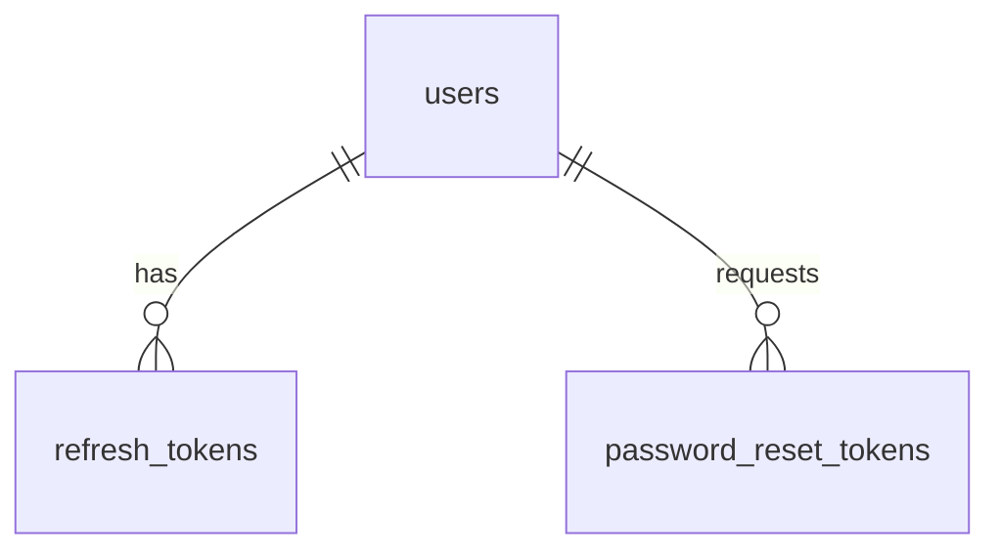

# TaskFlow - Authentication Schema

## Overview

This document describes the database schema for the authentication system in TaskFlow. It includes tables for user authentication, session management, and security tokens.

## Tables

### users
Stores basic user authentication information.

```sql
CREATE TABLE users (
  id UUID PRIMARY KEY DEFAULT gen_random_uuid(),
  name VARCHAR(255) NOT NULL,
  email VARCHAR(255) UNIQUE NOT NULL,
  password_hash VARCHAR(255) NOT NULL,
  created_at TIMESTAMP WITH TIME ZONE DEFAULT NOW(),
  updated_at TIMESTAMP WITH TIME ZONE DEFAULT NOW()
);
```

**Columns:**
- `id`: Unique identifier for the user (UUID)
- `name`: User's full name
- `email`: User's email address (unique)
- `password_hash`: Bcrypt hash of the user's password
- `created_at`: Timestamp when the user was created
- `updated_at`: Timestamp when the user was last updated

**Indexes:**
- Primary key on `id`
- Unique index on `email`

### refresh_tokens
Stores refresh tokens for session management.

```sql
CREATE TABLE refresh_tokens (
  id UUID PRIMARY KEY DEFAULT gen_random_uuid(),
  user_id UUID REFERENCES users(id) ON DELETE CASCADE,
  token_hash VARCHAR(255) NOT NULL,
  expires_at TIMESTAMP WITH TIME ZONE NOT NULL,
  created_at TIMESTAMP WITH TIME ZONE DEFAULT NOW()
);
```

**Columns:**
- `id`: Unique identifier for the refresh token (UUID)
- `user_id`: Reference to the user who owns this token
- `token_hash`: Hash of the refresh token
- `expires_at`: Timestamp when the token expires
- `created_at`: Timestamp when the token was created

**Indexes:**
- Primary key on `id`
- Index on `user_id`
- Index on `token_hash`
- Index on `expires_at`

### password_reset_tokens
Stores password reset tokens for account recovery.

```sql
CREATE TABLE password_reset_tokens (
  id UUID PRIMARY KEY DEFAULT gen_random_uuid(),
  user_id UUID REFERENCES users(id) ON DELETE CASCADE,
  token_hash VARCHAR(255) NOT NULL,
  expires_at TIMESTAMP WITH TIME ZONE NOT NULL,
  created_at TIMESTAMP WITH TIME ZONE DEFAULT NOW()
);
```

**Columns:**
- `id`: Unique identifier for the password reset token (UUID)
- `user_id`: Reference to the user who requested the reset
- `token_hash`: Hash of the password reset token
- `expires_at`: Timestamp when the token expires
- `created_at`: Timestamp when the token was created

**Indexes:**
- Primary key on `id`
- Index on `user_id`
- Index on `token_hash`
- Index on `expires_at`

## Relationships



## Security Considerations

### Password Storage
- Passwords are never stored in plain text
- Bcrypt with a cost factor of at least 12 is used for hashing
- Password hashes are stored with random salts

### Token Management
- Tokens are stored as hashes to prevent token theft
- Refresh tokens have expiration times
- Expired tokens are periodically cleaned up
- Tokens are invalidated on logout

### Data Protection
- All connections to the database are encrypted with SSL/TLS
- Database access is restricted to authorized services only
- Regular security audits of database access patterns

## Indexing Strategy

### Primary Indexes
- Primary key indexes on all `id` columns

### Foreign Key Indexes
- Indexes on all foreign key columns (`user_id`)

### Query Performance Indexes
- Unique index on `users.email` for fast login lookups
- Index on `refresh_tokens.token_hash` for token validation
- Index on `refresh_tokens.expires_at` for cleanup operations
- Index on `password_reset_tokens.token_hash` for reset validation
- Index on `password_reset_tokens.expires_at` for cleanup operations

## Constraints

### Primary Keys
- All tables have UUID primary keys generated by `gen_random_uuid()`

### Foreign Keys
- `refresh_tokens.user_id` references `users.id` with CASCADE DELETE
- `password_reset_tokens.user_id` references `users.id` with CASCADE DELETE

### Check Constraints
- Email format validation at application level
- Password strength validation at application level

### Unique Constraints
- `users.email` is unique across the system

## Triggers

### updated_at Maintenance
```sql
CREATE OR REPLACE FUNCTION update_updated_at_column()
RETURNS TRIGGER AS $$
BEGIN
    NEW.updated_at = NOW();
    RETURN NEW;
END;
$$ language 'plpgsql';

CREATE TRIGGER update_users_updated_at BEFORE UPDATE
ON users FOR EACH ROW EXECUTE PROCEDURE
update_updated_at_column();
```

## Maintenance

### Cleanup Jobs
Regular cleanup jobs should be implemented to:
1. Remove expired refresh tokens
2. Remove expired password reset tokens
3. Archive old authentication logs (if implemented)

### Monitoring
Key metrics to monitor:
1. Authentication success/failure rates
2. Password reset request frequency
3. Refresh token usage patterns
4. Database query performance for auth-related queries

This schema provides a secure and scalable foundation for the authentication system in TaskFlow.