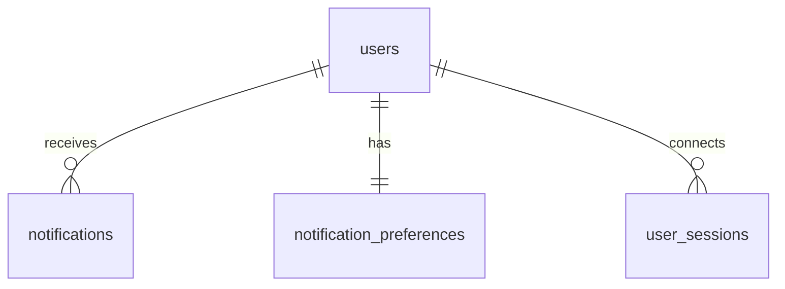

# TaskFlow - Notification Schema

## Overview

This document describes the database schema for the notification system in TaskFlow. It includes tables for notifications, user preferences, and WebSocket session management.

## Tables

### notifications
Stores user notifications.

```sql
CREATE TABLE notifications (
  id UUID PRIMARY KEY DEFAULT gen_random_uuid(),
  user_id UUID REFERENCES users(id) ON DELETE CASCADE,
  title VARCHAR(255) NOT NULL,
  description TEXT,
  type VARCHAR(50) NOT NULL,  -- task, project, comment, mention
  read BOOLEAN DEFAULT FALSE,
  created_at TIMESTAMP WITH TIME ZONE DEFAULT NOW(),
  updated_at TIMESTAMP WITH TIME ZONE DEFAULT NOW()
);
```

**Columns:**
- `id`: Unique identifier for the notification (UUID)
- `user_id`: Reference to the user who receives this notification
- `title`: Notification title
- `description`: Notification description
- `type`: Notification type (task, project, comment, mention)
- `read`: Whether the notification has been read
- `created_at`: Timestamp when the notification was created
- `updated_at`: Timestamp when the notification was last updated

### notification_preferences
Stores user notification preferences.

```sql
CREATE TABLE notification_preferences (
  id UUID PRIMARY KEY DEFAULT gen_random_uuid(),
  user_id UUID REFERENCES users(id) ON DELETE CASCADE,
  email_task_assigned BOOLEAN DEFAULT TRUE,
  email_task_completed BOOLEAN DEFAULT TRUE,
  email_comment_added BOOLEAN DEFAULT TRUE,
  email_deadline_approaching BOOLEAN DEFAULT TRUE,
  push_task_assigned BOOLEAN DEFAULT TRUE,
  push_task_completed BOOLEAN DEFAULT FALSE,
  push_comment_added BOOLEAN DEFAULT TRUE,
  push_deadline_approaching BOOLEAN DEFAULT TRUE,
  updated_at TIMESTAMP WITH TIME ZONE DEFAULT NOW(),
  UNIQUE(user_id)
);
```

**Columns:**
- `id`: Unique identifier for the preference record (UUID)
- `user_id`: Reference to the user
- `email_task_assigned`: Whether to send email for task assignments
- `email_task_completed`: Whether to send email for task completions
- `email_comment_added`: Whether to send email for comments
- `email_deadline_approaching`: Whether to send email for approaching deadlines
- `push_task_assigned`: Whether to send push for task assignments
- `push_task_completed`: Whether to send push for task completions
- `push_comment_added`: Whether to send push for comments
- `push_deadline_approaching`: Whether to send push for approaching deadlines
- `updated_at`: Timestamp when preferences were last updated

### user_sessions
Stores active WebSocket sessions for real-time notifications.

```sql
CREATE TABLE user_sessions (
  id UUID PRIMARY KEY DEFAULT gen_random_uuid(),
  user_id UUID REFERENCES users(id) ON DELETE CASCADE,
  socket_id VARCHAR(255) NOT NULL,
  connected_at TIMESTAMP WITH TIME ZONE DEFAULT NOW(),
  UNIQUE(socket_id)
);
```

**Columns:**
- `id`: Unique identifier for the session (UUID)
- `user_id`: Reference to the user
- `socket_id`: WebSocket connection identifier
- `connected_at`: Timestamp when the session was established

## Relationships



## Security Considerations

### Data Protection
- All connections to the database are encrypted with SSL/TLS
- Database access is restricted to authorized services only
- Notification data is protected with appropriate access controls

### Privacy
- Notification content is only visible to the intended recipient
- User preferences are encrypted at rest
- Session data is regularly cleaned up

## Indexing Strategy

### Primary Indexes
- Primary key indexes on all `id` columns

### Foreign Key Indexes
- Indexes on all foreign key columns (`user_id`)

### Query Performance Indexes
- Index on `notifications.user_id` for user notification queries
- Index on `notifications.read` for filtering read/unread notifications
- Index on `notifications.type` for filtering by notification type
- Index on `notifications.created_at` for sorting by creation time
- Index on `user_sessions.user_id` for user session queries
- Index on `user_sessions.socket_id` for session lookup

## Constraints

### Primary Keys
- All tables have UUID primary keys generated by `gen_random_uuid()`

### Foreign Keys
- `notifications.user_id` references `users.id` with CASCADE DELETE
- `notification_preferences.user_id` references `users.id` with CASCADE DELETE
- `user_sessions.user_id` references `users.id` with CASCADE DELETE

### Check Constraints
- `notifications.type` must be one of: 'task', 'project', 'comment', 'mention'

### Unique Constraints
- `notification_preferences.user_id` is unique to ensure one preference record per user
- `user_sessions.socket_id` is unique to ensure one session per socket

## Triggers

### updated_at Maintenance
```sql
CREATE OR REPLACE FUNCTION update_updated_at_column()
RETURNS TRIGGER AS $$
BEGIN
    NEW.updated_at = NOW();
    RETURN NEW;
END;
$$ language 'plpgsql';

CREATE TRIGGER update_notifications_updated_at BEFORE UPDATE
ON notifications FOR EACH ROW EXECUTE PROCEDURE
update_updated_at_column();

CREATE TRIGGER update_notification_preferences_updated_at BEFORE UPDATE
ON notification_preferences FOR EACH ROW EXECUTE PROCEDURE
update_updated_at_column();
```

## Maintenance

### Cleanup Jobs
Regular cleanup jobs should be implemented to:
1. Remove old read notifications (after 30 days)
2. Clean up expired user sessions
3. Archive notification statistics

### Monitoring
Key metrics to monitor:
1. Notification delivery rates
2. WebSocket connection success rates
3. Database query performance for notification queries
4. Email delivery success rates

This schema provides a scalable foundation for the notification system in TaskFlow.