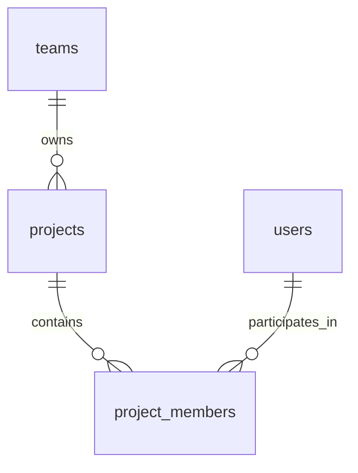

# TaskFlow - Project Schema

## Overview

This document describes the database schema for project management in TaskFlow. It includes tables for projects, project memberships, and project-related metadata.

## Tables

### projects
Stores information about projects.

```sql
CREATE TABLE projects (
  id UUID PRIMARY KEY DEFAULT gen_random_uuid(),
  name VARCHAR(255) NOT NULL,
  description TEXT,
  team_id UUID REFERENCES teams(id) ON DELETE CASCADE,
  status VARCHAR(50) NOT NULL DEFAULT 'active',  -- active, archived
  created_at TIMESTAMP WITH TIME ZONE DEFAULT NOW(),
  updated_at TIMESTAMP WITH TIME ZONE DEFAULT NOW()
);
```

**Columns:**
- `id`: Unique identifier for the project (UUID)
- `name`: Project name
- `description`: Project description
- `team_id`: Reference to the team that owns this project
- `status`: Project status (active, archived)
- `created_at`: Timestamp when the project was created
- `updated_at`: Timestamp when the project was last updated

### project_members
Stores project membership information.

```sql
CREATE TABLE project_members (
  id UUID PRIMARY KEY DEFAULT gen_random_uuid(),
  project_id UUID REFERENCES projects(id) ON DELETE CASCADE,
  user_id UUID REFERENCES users(id) ON DELETE CASCADE,
  role VARCHAR(50) NOT NULL DEFAULT 'member',  -- owner, member
  created_at TIMESTAMP WITH TIME ZONE DEFAULT NOW(),
  UNIQUE(project_id, user_id)
);
```

**Columns:**
- `id`: Unique identifier for the membership (UUID)
- `project_id`: Reference to the project
- `user_id`: Reference to the user
- `role`: User's role in the project (owner, member)
- `created_at`: Timestamp when the membership was created

## Relationships



## Security Considerations

### Data Protection
- All connections to the database are encrypted with SSL/TLS
- Database access is restricted to authorized services only
- Project data is protected with appropriate access controls

### Privacy
- Project details are only visible to team members
- Project membership information is protected
- Sensitive project data is encrypted where appropriate

## Indexing Strategy

### Primary Indexes
- Primary key indexes on all `id` columns

### Foreign Key Indexes
- Indexes on all foreign key columns (`team_id`, `project_id`, `user_id`)

### Query Performance Indexes
- Index on `projects.team_id` for team project queries
- Index on `projects.status` for status filtering
- Composite index on `project_members(project_id, role)` for project member queries
- Index on `project_members.user_id` for user project queries

## Constraints

### Primary Keys
- All tables have UUID primary keys generated by `gen_random_uuid()`

### Foreign Keys
- `projects.team_id` references `teams.id` with CASCADE DELETE
- `project_members.project_id` references `projects.id` with CASCADE DELETE
- `project_members.user_id` references `users.id` with CASCADE DELETE

### Check Constraints
- `projects.status` must be either 'active' or 'archived'
- `project_members.role` must be either 'owner' or 'member'

### Unique Constraints
- `project_members(project_id, user_id)` is unique to prevent duplicate memberships
- `projects.name` is unique within a team (handled at application level)

## Triggers

### updated_at Maintenance
```sql
CREATE OR REPLACE FUNCTION update_updated_at_column()
RETURNS TRIGGER AS $$
BEGIN
    NEW.updated_at = NOW();
    RETURN NEW;
END;
$$ language 'plpgsql';

CREATE TRIGGER update_projects_updated_at BEFORE UPDATE
ON projects FOR EACH ROW EXECUTE PROCEDURE
update_updated_at_column();
```

## Maintenance

### Cleanup Jobs
Regular cleanup jobs should be implemented to:
1. Remove orphaned project memberships
2. Archive completed projects (if implemented)
3. Clean up invalid project data

### Monitoring
Key metrics to monitor:
1. Project creation and completion rates
2. Project membership changes
3. Database query performance for project queries
4. Storage usage for project-related data

This schema provides a flexible and scalable foundation for project management in TaskFlow.