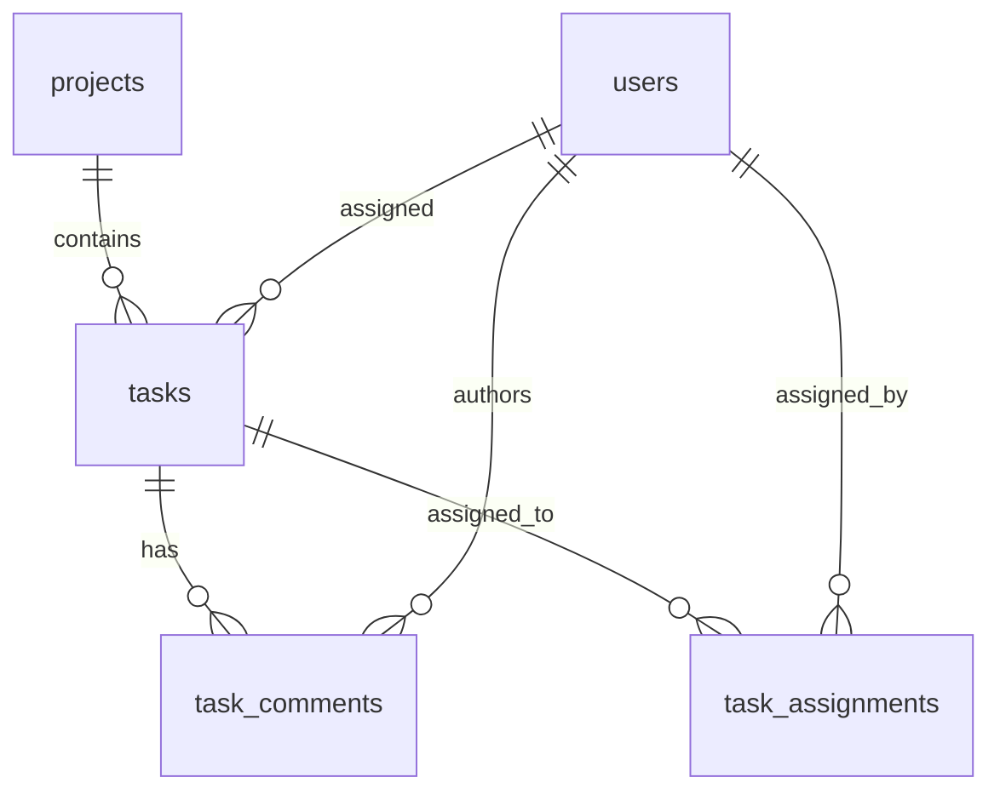

# TaskFlow - Task Schema

## Overview

This document describes the database schema for task management in TaskFlow. It includes tables for tasks, task assignments, comments, and task-related metadata.

## Tables

### tasks
Stores information about tasks.

```sql
CREATE TABLE tasks (
  id UUID PRIMARY KEY DEFAULT gen_random_uuid(),
  title VARCHAR(255) NOT NULL,
  description TEXT,
  project_id UUID REFERENCES projects(id) ON DELETE CASCADE,
  status VARCHAR(50) NOT NULL DEFAULT 'todo',     -- todo, in-progress, review, done
  priority VARCHAR(50) NOT NULL DEFAULT 'medium', -- low, medium, high
  assignee_id UUID REFERENCES users(id) ON DELETE SET NULL,
  due_date TIMESTAMP WITH TIME ZONE,
  created_at TIMESTAMP WITH TIME ZONE DEFAULT NOW(),
  updated_at TIMESTAMP WITH TIME ZONE DEFAULT NOW()
);
```

**Columns:**
- `id`: Unique identifier for the task (UUID)
- `title`: Task title
- `description`: Task description
- `project_id`: Reference to the project this task belongs to
- `status`: Task status (todo, in-progress, review, done)
- `priority`: Task priority (low, medium, high)
- `assignee_id`: Reference to the user assigned to this task
- `due_date`: Task due date
- `created_at`: Timestamp when the task was created
- `updated_at`: Timestamp when the task was last updated

### task_comments
Stores comments on tasks.

```sql
CREATE TABLE task_comments (
  id UUID PRIMARY KEY DEFAULT gen_random_uuid(),
  content TEXT NOT NULL,
  task_id UUID REFERENCES tasks(id) ON DELETE CASCADE,
  author_id UUID REFERENCES users(id) ON DELETE CASCADE,
  created_at TIMESTAMP WITH TIME ZONE DEFAULT NOW(),
  updated_at TIMESTAMP WITH TIME ZONE DEFAULT NOW()
);
```

**Columns:**
- `id`: Unique identifier for the comment (UUID)
- `content`: Comment content
- `task_id`: Reference to the task this comment belongs to
- `author_id`: Reference to the user who authored this comment
- `created_at`: Timestamp when the comment was created
- `updated_at`: Timestamp when the comment was last updated

### task_assignments
Stores task assignment information (for multiple assignees).

```sql
CREATE TABLE task_assignments (
  id UUID PRIMARY KEY DEFAULT gen_random_uuid(),
  task_id UUID REFERENCES tasks(id) ON DELETE CASCADE,
  user_id UUID REFERENCES users(id) ON DELETE CASCADE,
  assigned_at TIMESTAMP WITH TIME ZONE DEFAULT NOW(),
  assigned_by UUID REFERENCES users(id),
  UNIQUE(task_id, user_id)
);
```

**Columns:**
- `id`: Unique identifier for the assignment (UUID)
- `task_id`: Reference to the task
- `user_id`: Reference to the user
- `assigned_at`: Timestamp when the assignment was made
- `assigned_by`: Reference to the user who made the assignment

## Relationships



## Security Considerations

### Data Protection
- All connections to the database are encrypted with SSL/TLS
- Database access is restricted to authorized services only
- Task data is protected with appropriate access controls

### Privacy
- Task details are only visible to project members
- Task comments are only visible to project members
- Sensitive task data is encrypted where appropriate

## Indexing Strategy

### Primary Indexes
- Primary key indexes on all `id` columns

### Foreign Key Indexes
- Indexes on all foreign key columns (`project_id`, `assignee_id`, `task_id`, `author_id`, `user_id`, `assigned_by`)

### Query Performance Indexes
- Index on `tasks.project_id` for project task queries
- Index on `tasks.status` for status filtering
- Index on `tasks.priority` for priority filtering
- Index on `tasks.assignee_id` for assignee queries
- Index on `tasks.due_date` for due date queries
- Index on `task_comments.task_id` for task comment queries
- Index on `task_comments.author_id` for author queries
- Index on `task_assignments.task_id` for task assignment queries
- Index on `task_assignments.user_id` for user assignment queries

## Constraints

### Primary Keys
- All tables have UUID primary keys generated by `gen_random_uuid()`

### Foreign Keys
- `tasks.project_id` references `projects.id` with CASCADE DELETE
- `tasks.assignee_id` references `users.id` with SET NULL
- `task_comments.task_id` references `tasks.id` with CASCADE DELETE
- `task_comments.author_id` references `users.id` with CASCADE DELETE
- `task_assignments.task_id` references `tasks.id` with CASCADE DELETE
- `task_assignments.user_id` references `users.id` with CASCADE DELETE
- `task_assignments.assigned_by` references `users.id`

### Check Constraints
- `tasks.status` must be one of: 'todo', 'in-progress', 'review', 'done'
- `tasks.priority` must be one of: 'low', 'medium', 'high'

### Unique Constraints
- `task_assignments(task_id, user_id)` is unique to prevent duplicate assignments

## Triggers

### updated_at Maintenance
```sql
CREATE OR REPLACE FUNCTION update_updated_at_column()
RETURNS TRIGGER AS $$
BEGIN
    NEW.updated_at = NOW();
    RETURN NEW;
END;
$$ language 'plpgsql';

CREATE TRIGGER update_tasks_updated_at BEFORE UPDATE
ON tasks FOR EACH ROW EXECUTE PROCEDURE
update_updated_at_column();

CREATE TRIGGER update_task_comments_updated_at BEFORE UPDATE
ON task_comments FOR EACH ROW EXECUTE PROCEDURE
update_updated_at_column();
```

## Maintenance

### Cleanup Jobs
Regular cleanup jobs should be implemented to:
1. Remove orphaned task comments
2. Clean up old task assignments
3. Archive completed tasks (if implemented)
4. Clean up invalid task data

### Monitoring
Key metrics to monitor:
1. Task creation and completion rates
2. Task assignment changes
3. Database query performance for task queries
4. Storage usage for task-related data

This schema provides a flexible and scalable foundation for task management in TaskFlow.