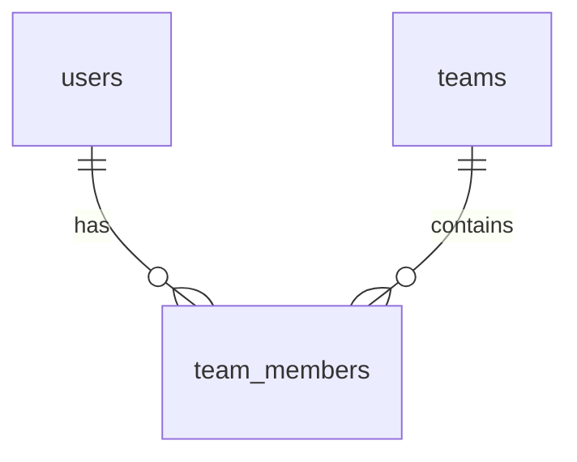

# TaskFlow - User Schema

## Overview

This document describes the database schema for user profiles and team management in TaskFlow. It includes tables for user profiles, teams, and team memberships.

## Tables

### users (extended)
Extends the authentication users table with profile information.

```sql
CREATE TABLE users (
  id UUID PRIMARY KEY DEFAULT gen_random_uuid(),
  name VARCHAR(255) NOT NULL,
  email VARCHAR(255) UNIQUE NOT NULL,
  password_hash VARCHAR(255) NOT NULL,
  avatar VARCHAR(255),
  bio TEXT,
  created_at TIMESTAMP WITH TIME ZONE DEFAULT NOW(),
  updated_at TIMESTAMP WITH TIME ZONE DEFAULT NOW()
);
```

**Additional Columns:**
- `avatar`: URL to the user's profile picture
- `bio`: User's biography or description

### teams
Stores information about teams.

```sql
CREATE TABLE teams (
  id UUID PRIMARY KEY DEFAULT gen_random_uuid(),
  name VARCHAR(255) NOT NULL,
  description TEXT,
  created_at TIMESTAMP WITH TIME ZONE DEFAULT NOW(),
  updated_at TIMESTAMP WITH TIME ZONE DEFAULT NOW()
);
```

**Columns:**
- `id`: Unique identifier for the team (UUID)
- `name`: Team name
- `description`: Team description
- `created_at`: Timestamp when the team was created
- `updated_at`: Timestamp when the team was last updated

### team_members
Stores team membership information.

```sql
CREATE TABLE team_members (
  id UUID PRIMARY KEY DEFAULT gen_random_uuid(),
  team_id UUID REFERENCES teams(id) ON DELETE CASCADE,
  user_id UUID REFERENCES users(id) ON DELETE CASCADE,
  role VARCHAR(50) NOT NULL DEFAULT 'member',  -- admin, member
  created_at TIMESTAMP WITH TIME ZONE DEFAULT NOW(),
  UNIQUE(team_id, user_id)
);
```

**Columns:**
- `id`: Unique identifier for the membership (UUID)
- `team_id`: Reference to the team
- `user_id`: Reference to the user
- `role`: User's role in the team (admin, member)
- `created_at`: Timestamp when the membership was created

## Relationships



## Security Considerations

### Data Protection
- All connections to the database are encrypted with SSL/TLS
- Database access is restricted to authorized services only
- User profile data is protected with appropriate access controls

### Privacy
- User bios and other profile information are only visible to team members
- Email addresses are protected and not publicly visible
- Avatar URLs are validated to prevent malicious content

## Indexing Strategy

### Primary Indexes
- Primary key indexes on all `id` columns

### Foreign Key Indexes
- Indexes on all foreign key columns (`team_id`, `user_id`)

### Query Performance Indexes
- Unique index on `teams.name` for fast team lookups
- Composite index on `team_members(team_id, role)` for team member queries
- Index on `team_members.user_id` for user team queries

## Constraints

### Primary Keys
- All tables have UUID primary keys generated by `gen_random_uuid()`

### Foreign Keys
- `team_members.team_id` references `teams.id` with CASCADE DELETE
- `team_members.user_id` references `users.id` with CASCADE DELETE

### Check Constraints
- `team_members.role` must be either 'admin' or 'member'

### Unique Constraints
- `team_members(team_id, user_id)` is unique to prevent duplicate memberships
- `teams.name` is unique across the system

## Triggers

### updated_at Maintenance
```sql
CREATE OR REPLACE FUNCTION update_updated_at_column()
RETURNS TRIGGER AS $$
BEGIN
    NEW.updated_at = NOW();
    RETURN NEW;
END;
$$ language 'plpgsql';

CREATE TRIGGER update_teams_updated_at BEFORE UPDATE
ON teams FOR EACH ROW EXECUTE PROCEDURE
update_updated_at_column();
```

## Maintenance

### Cleanup Jobs
Regular cleanup jobs should be implemented to:
1. Remove orphaned team memberships
2. Archive inactive teams (if implemented)
3. Clean up invalid avatar URLs

### Monitoring
Key metrics to monitor:
1. Team creation and dissolution rates
2. Team membership changes
3. Database query performance for user and team queries
4. Storage usage for avatar images

This schema provides a flexible and scalable foundation for user profiles and team management in TaskFlow.